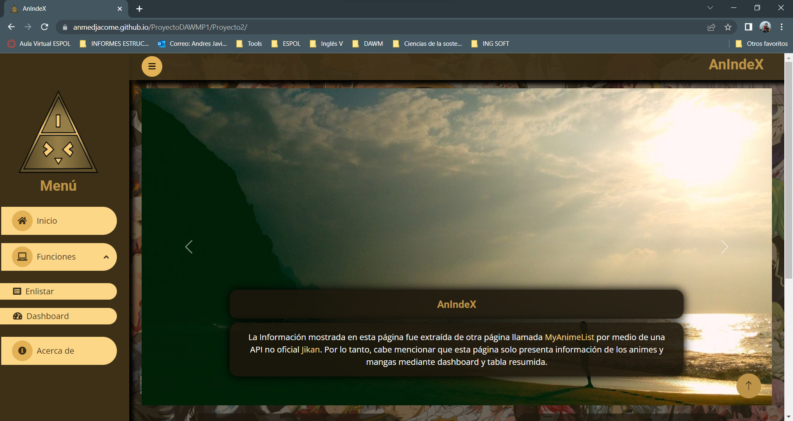
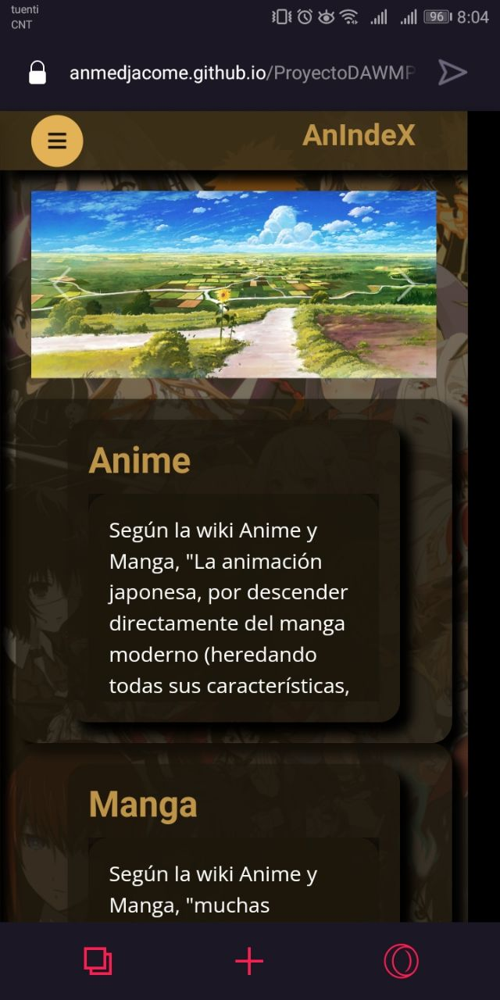

# Página web - AnIndeX

Sitio web enfocado en mostrar en gráficos estadísticos sobre el número de [animes](https://anime-para-el-kokoro.fandom.com/es/wiki/%C2%BFQue_es_el_anime%3F) y [mangas](https://anime-para-el-kokoro.fandom.com/es/wiki/%C2%BFQu%C3%A9_es_el_manga%3F) según su género, estado de emisión, temporada (época del año), en el caso de los animes se muestra un indicador de los tipos, ya sean TV, OVA o Pelicula. Cabe recalcar que existen varias formas de filtrar información con estas dos variables, en especial porque los valores son relativamente grandes. Además, tambien presenta una lista de anime y manga con la opción de filtrar por género especifico o estado de emisión del mismo y ordenarlos según su popularidad.

Creado por: Andrés Medina

Paralelo: 02.

## API de la página elegida

Esta información es obtenida de la página ["JIKAN"](https://jikan.moe/), la cual ofrece una API que extrae datos recopilados de la página [MyAnimeList](https://myanimelist.net/) que permite crear una lista de anime y manga, además de dar la oportunidad de calificar los mismos según su preferencia.

Enlace a documento de API: https://docs.api.jikan.moe/

## Plantilla usada
DarkPan - Free Responsive Bootstrap 5 Admin Dashboard Template. (2022). Retrieved 9 June 2022, from https://themewagon.com/themes/free-bootstrap-5-admin-dashboard-template-darkpan/

## Vista previa

Vista web | Vista móvil
--- | ---
 | 

## Referencias
* (2022). Retrieved 12 June 2022, from https://www.youtube.com/watch?v=_fd5J5k9KZ0
* Bootstrap 5 Background Image - examples & tutorial. (2022). Retrieved 12 June 2022, from https://mdbootstrap.com/docs/standard/content-styles/background-image/
* Bootstrap 5 Animations - examples & tutorial. (2022). Retrieved 12 June 2022, from https://mdbootstrap.com/docs/standard/content-styles/animations/
* MDB tools. (2022). Retrieved 12 June 2022, from https://mdbootstrap.com/docs/standard/tools/
* Bootstrap Masks - examples & tutorial. (2022). Retrieved 12 June 2022, from https://mdbootstrap.com/docs/standard/content-styles/masks/
* Leer archivos en JavaScript. (2010). Retrieved 16 June 2022, from https://web.dev/i18n/es/read-files/
* getElementById, h., Gondliya, V., & gupta, s. (2015). how to get value of li tag which is in ul tag using getElementById. Retrieved 21 June 2022, from https://stackoverflow.com/questions/30392283/how-to-get-value-of-li-tag-which-is-in-ul-tag-using-getelementbyid
* Insertar elementos en el DOM - Javascript en español. (2022). Retrieved 21 June 2022, from https://lenguajejs.com/javascript/dom/insertar-elementos-dom/
* onclick Event. (2022). Retrieved 22 June 2022, from https://www.w3schools.com/jsref/event_onclick.asp
* JavaScript, H. (2021). How to Get an Input's Value with JavaScript - Tabnine Academy. Retrieved 22 June 2022, from https://www.tabnine.com/academy/javascript/get-value-of-input/
* Expresiones Regulares - JavaScript | MDN. (2022). Retrieved 22 June 2022, from https://developer.mozilla.org/es/docs/Web/JavaScript/Guide/Regular_Expressions
* Mark Otto, a. (2022). Tables. Retrieved 22 June 2022, from https://getbootstrap.com/docs/4.0/content/tables/#hoverable-rows
* Bootstrap Navbar - examples & tutorial. (2022). Retrieved 22 June 2022, from https://mdbootstrap.com/docs/standard/navigation/navbar/
* Gandy, D. (2022). Font Awesome Icons. Retrieved 22 June 2022, from https://fontawesome.com/v4/icons/
* Colecciones con clave - JavaScript | MDN. (2020). Retrieved 24 June 2022, from https://developer.mozilla.org/es/docs/Web/JavaScript/Guide/Keyed_collections
* Element.ariaValueNow - Web APIs | MDN. (2022). Retrieved 28 June 2022, from https://developer.mozilla.org/en-US/docs/Web/API/Element/ariaValueNow
* Bootstrap Progress Bars. (2022). Retrieved 28 June 2022, from https://www.w3schools.com/bootstrap/bootstrap_progressbars.asp
* Chart.js | Chart.js. (2022). Retrieved 29 June 2022, from https://www.chartjs.org/docs/3.3.2/
* Farid, M. (2022). Comprobar si el elemento existe en el DOM en JavaScript. Retrieved 3 July 2022, from https://www.delftstack.com/es/howto/javascript/javascript-check-element-exists-in-dom/

## Recursos externos

### Imágenes utilizadas

* https://wallpaperaccess.com/anime-summer-scenery
* https://wallpaperaccess.com/anime-night-scenery
* https://wallpaperaccess.com/anime-evening
* https://images7.alphacoders.com/306/306919.jpg
* https://images7.alphacoders.com/729/thumb-1920-729209.jpg
* https://images3.alphacoders.com/848/848404.jpg
* https://wallpapercave.com/wp/wp7283079.png
* https://wallpaperaccess.com/full/4804007.png
* https://wallpaperaccess.com/full/1083911.jpg
* https://images2.alphacoders.com/776/thumb-1920-776081.jpg
* https://images8.alphacoders.com/695/695848.png
* https://images6.alphacoders.com/697/thumb-1920-697221.png
* https://images8.alphacoders.com/914/thumb-1920-914289.jpg
* https://images5.alphacoders.com/945/thumb-1920-945730.png
* https://images7.alphacoders.com/871/871488.jpg
* https://wallpaperaccess.com/full/2012826.jpg
* https://wallpaperaccess.com/full/6351957.png
* https://wallpapercave.com/wp/wp4786465.png
* https://images3.alphacoders.com/228/thumb-1920-228275.jpg
* https://wallpapercave.com/wp/wp1833405.jpg