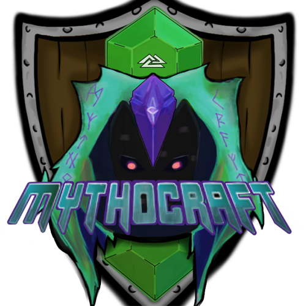

# Proyectos 2022-1T - Desarrollo de Aplicaciones Web y móviles

## Inicio

En este repositorio se encuentran proyectos desarrollados con fines académicos pero también con la idea de ser mejorados para ser puestas en línea y cumplir con sus respectivos objetivos.

## Indice de proyectos

<table>
  <thead>
    <tr>
      <th>Número</th>
      <th>Logo</th>
      <th>Nombre</th>
      <th>Descripción</th>
    </tr>
  </thead>
  <tbody>
    <tr>
      <td align="center">1</td>
      <td align="center">
        
      </td>
      <td align="center">
        <a href="Proyecto1">ImagiNeboulux</a>
      </td>
      <td align="center">
        Sitio web de presentación de mi perfil laboral donde presento mi información pública y una lista de proyectos que he realizado hasta la fecha.
      </td>
    </tr>
    <tr>
      <td align="center">2</td>
      <td align="center">
        
      </td>
      <td align="center">
        <a href="Proyecto2">MythoCraft Network</a>
      </td>
      <td align="center">
        Sitio web de un servidor del juego Minecraft cuya finalidad tiene mostrar datos procesados por medio de gráficos estadísticos considerando variables como tiempo de juego en el servidor, número de jugadores, entre otras.
      </td>
    </tr>
  </tbody>
</table>